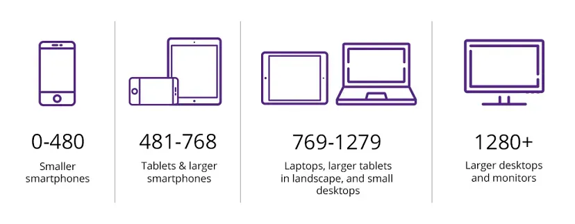

# Responsive & BreakPoint

<aside>
💡

**반응형 웹 디자인은 다양한 화면 크기와 장치에서 웹사이트가 효과적으로 보이고 작동하도록 하는 디자인 접근 방식, 특정 화면 크기나 장치 특성에 따라 스타일을 변경할 수 있는 지점**

</aside>

## 이론

---

```css
@media screen and (max-width: 1024px) {
  /* 1024px보다 작을 때 적용할 스타일 */
}
```


